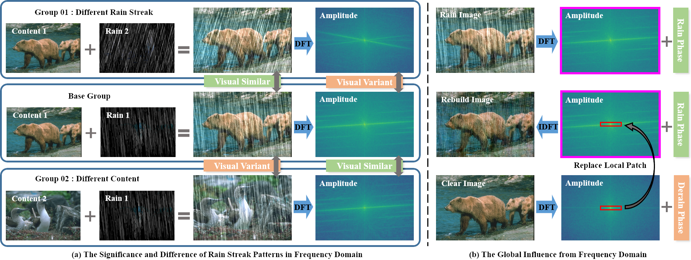
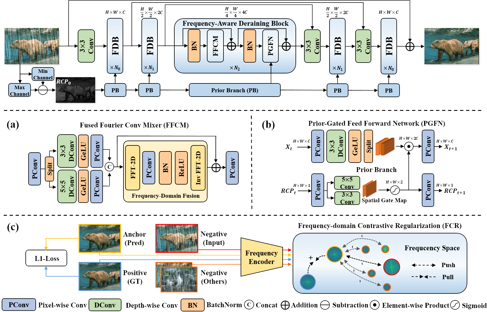
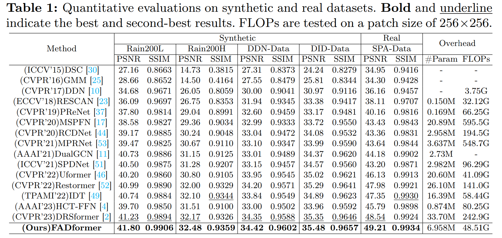

# Efficient Frequency-Domain Image Deraining with Contrastive Regularization (ECCV2024)
The official implementation of ECCV2024 paper "Efficient Frequency-Domain Image Deraining with Contrastive Regularization"

[paper link](https://www.ecva.net/papers/eccv_2024/papers_ECCV/papers/05751.pdf)

2024/09/25 Update：The code is now open, welcome to ask questions in the issue, we will try our best to solve errors and doubts

2024/09/26 Update: Pre-trained weights and visualization images are provided by link.

2024/09/29 Update: You can download our paper [here](https://www.ecva.net/papers/eccv_2024/papers_ECCV/papers/05751.pdf)! 

2024/11/12 Update: You can now find the official republication of Springer here, including supple materials: https://link.springer.com/chapter/10.1007/978-3-031-72940-9_14

## Authors

- Ning Gao
- Xingyu Jiang
- Xiuhui Zhang
- Yue Deng *

School of Astronautics, Beihang University, Beijing, China

## Abstract

Most current single image-deraining (SID) methods are based on the Transformer with global modeling for high-quality reconstruction. However, their architectures only build long-range features from the spatial domain, which suffers from a significant computational burden to keep effectiveness. Besides, these methods either overlook negative sample information in training or underutilize the rain streak patterns present in the negative ones. To tackle these problems, we propose a Frequency-Aware Deraining Transformer Framework (FADformer) that fully captures frequency domain features for efficient rain removal. Specifically, we construct the FADBlock, including the Fused Fourier Convolution Mixer (FFCM) and Prior-Gated Feed-forward Network (PGFN). Unlike self-attention mechanisms, the FFCM conducts convolution operations in both spatial and frequency domains, endowing it with local-global capturing capabilities and efficiency. Simultaneously, the PGFN introduces residue channel prior in a gating manner to enhance local details and retain feature structure. Furthermore, we introduce a Frequency-domain Contrastive Regularization (FCR) during training. The FCR facilitates contrastive learning in the frequency domain and leverages rain streak patterns in negative samples to improve performance. Extensive experiments show the efficiency and effectiveness of our FADformer.

## Keywords

- SID
- Frequency Learning
- Contrastive Regularization

## Motivation



## Method



## Results



## Pre-trained Models

<table>
<thead>
  <tr>
    <th>Dataset</th>
    <th>Rain200L</th>
    <th>Rain200H</th>
    <th>DID-Data</th>
    <th>DDN-Data</th>
    <th>SPA-Data</th>
  </tr>
</thead>
<tbody>
  <tr>
    <td>Baidu NetDisk</td>
    <td> <a href="https://pan.baidu.com/s/14-xuieEB4gW6VO5KHCcNFQ?pwd=cozn">Download (cozn)</a>  </td>
    <td> <a href="https://pan.baidu.com/s/1kTEeWv6FvicdAa-m49M33A?pwd=qw5d">Download (qw5d)</a>  </td>
    <td> <a href="https://pan.baidu.com/s/12wkegevMjiQCh6yvG8dDXA?pwd=0vcr">Download (0vcr)</a>  </td>
    <td> <a href="https://pan.baidu.com/s/132Qz9TflresThDdjZAzvDA?pwd=c313">Download (c313)</a>  </td>
    <td> <a href="https://pan.baidu.com/s/1iHbPEjuUMVYt9do7odrtmg?pwd=3s40">Download (3s40)</a>  </td>
  </tr>
</tbody>
</table>

## Visual Results

<table>
<thead>
  <tr>
    <th>Dataset</th>
    <th>Rain200L</th>
    <th>Rain200H</th>
    <th>DID-Data</th>
    <th>DDN-Data</th>
    <th>SPA-Data</th>
  </tr>
</thead>
<tbody>
  <tr>
    <td>Baidu NetDisk</td>
    <td> <a href="https://pan.baidu.com/s/1rObEpOlg3Edikkc07-qRyg?pwd=ktqb">Download (ktqb)</a>  </td>
    <td> <a href="https://pan.baidu.com/s/12c3jj0a0S-6V9HsBBKtlFw?pwd=qty6">Download (qty6)</a>  </td>
    <td> <a href="https://pan.baidu.com/s/1waEU-SMkAfzW5QLeD9q1yA?pwd=u3ju">Download (u3ju)</a>  </td>
    <td> <a href="https://pan.baidu.com/s/1HwsAlcMZRuzcSopgICyD5g?pwd=mqsr">Download (mqsr)</a>  </td>
    <td> <a href="https://pan.baidu.com/s/1v26LfteVl852d1ESDJjPsw?pwd=q6hx">Download (q6hx)</a>  </td>
  </tr>
</tbody>
</table>


## Supplementary Material

For more visualizations, see the supplementary material.

## References

Waiting for the publication of ECCV2024

```
